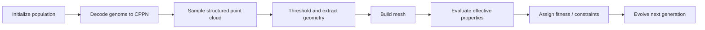

# Populating Cellular Metamaterials via Neuroevolution

Research code for the paper **"Populating cellular metamaterials on the extrema of attainable elasticity through neuroevolution"**.

This repository explores metamaterial unit-cell design with **CPPNs (Compositional Pattern-Producing Networks)** and a **modified NEAT-based multi-objective evolutionary pipeline**. The framework generates diverse cellular geometries, evaluates their homogenized elastic properties, and pushes the search toward the empirical bounds of attainable elasticity.


## Overview

Designing architected materials often requires navigating strong trade-offs between mechanical properties such as stiffness, shear response, and Poisson's ratio. Instead of optimizing a single hand-crafted topology, this project treats metamaterial discovery as a **search problem over geometry generators**:

- **CPPNs** encode geometry compactly and generate structured, highly regular patterns.
- **Modified NEAT** evolves both weights and topology of the CPPNs.
- **Finite-element homogenization** evaluates the effective properties of each generated unit cell.
- **Multi-objective selection and diversity mechanisms** help populate the Pareto frontier instead of converging to a single design.

The repository also contains follow-up engineering experiments for **injector/nozzle shape optimization**, built on the same "generate geometry -> mesh -> simulate -> score" workflow.

## Highlights

- CPPN-based generation of 2D unit-cell topologies on structured point clouds
- Multiple point-cloud symmetries: `nosym`, `sym2`, `sym4`, `rotate`, `parallel`
- Customized `neat-python` fork with archive-based multi-objective behavior and novelty-related utilities
- FEniCS / Dolfin-based periodic homogenization for effective elastic-property evaluation
- Utilities for geometry extraction, contour interpolation, meshing, constraint checking, and visualization
- Experimental subprojects for injector optimization with Gmsh, OpenFOAM, and DeepFlame workflows

## Method Pipeline



At the repository level, the main metamaterial workflow is:

1. Generate a structured point cloud for the chosen symmetry class.
2. Evaluate a CPPN on the point cloud.
3. Convert scalar outputs into material/void regions.
4. Construct a triangular mesh and enforce geometric constraints.
5. Solve periodic homogenization problems to compute effective properties.
6. Feed the results back into the evolutionary loop.

## Repository Layout

```text
.
├── main.py                     # Main entry for metamaterial evolution
├── config.ini                  # Core NEAT and experiment configuration
├── multi_task.py               # Batch task definitions across symmetries/trade-offs
├── gen_pcd.py                  # Point-cloud generation utilities
├── tools/                      # Geometry, meshing, homogenization, constraints, utils
├── neat/                       # Modified local neat-python implementation
├── injector_opt/               # Multi-objective injector optimization experiments
├── injector_single/            # Single-objective injector optimization workflow
├── design_framework/           # Framework snapshot / mirrored project layout
├── test/                       # Utility and exploratory test scripts
├── DOCUMENTATION.md            # Detailed Chinese project documentation
└── output/                     # Generated results, checkpoints, figures
```

## Main Components

### Core metamaterial workflow

- `main.py`: experiment entry point and genome evaluation loop
- `gen_pcd.py`: structured point-cloud generation for different symmetry assumptions
- `tools/shape.py`: contour extraction, triangulation, and geometry handling
- `tools/read_mesh.py`: conversion from generated geometry to FEniCS meshes
- `tools/period.py`: periodic homogenization and effective-property computation
- `tools/handle_constraints.py`: connectivity and validity checks

### Evolution engine

- `neat/`: local fork of `neat-python`
- `neat/population.py`: modified population flow for this research setup
- `neat/spea2.py`: archive and Pareto-related utilities
- `neat/ns.py`: novelty-search related support code

### Engineering extensions

- `injector_opt/`: injector/nozzle optimization with geometry perturbation, constraints, meshing, and external simulation hooks
- `injector_single/`: simplified single-objective version tailored for cluster execution and DeepFlame-based evaluation

## Requirements

The main metamaterial pipeline was developed around the following stack:

- Python 3.8
- NumPy
- SciPy
- Matplotlib
- FEniCS / Dolfin
- `cvxopt` (for some homogenization utilities)

Optional dependencies for the injector-related workflows include:

- Gmsh
- `mpi4py`
- OpenFOAM
- DeepFlame

Because this is a research codebase with several experimental branches, dependency management is partly workflow-specific. For the metamaterial experiments, the most important requirement is a working **FEniCS/Dolfin** environment.

## Installation

```bash
git clone https://github.com/mh-yan/evo_cppn_material.git
cd evo_cppn_material
```

Then install the dependencies required by your target workflow:

- **Metamaterial pipeline**: Python scientific stack + FEniCS/Dolfin
- **Injector pipeline**: Python scientific stack + Gmsh + MPI/OpenFOAM/DeepFlame toolchain

## Quick Start

### Run the main metamaterial experiment

```bash
python main.py
```

This uses the settings in `config.ini` and the default trade-off defined in `main.py`.

### Customize the experiment

Edit `config.ini` to control parameters such as:

- population size
- number of generations
- point-cloud density
- symmetry type (`pcdtype`)
- novelty/archive parameters

### Batch experiments

For multiple experiment definitions, inspect and edit `multi_task.py`, then enable task collection in `main.py`.

## Output and Data

Typical outputs include:

- evolved genomes (`.pkl`)
- generated meshes and contours
- fitness distribution plots
- intermediate geometry visualizations

The paper-related metamaterial database is publicly available here:

- [Metamaterial Database](https://doi.org/10.57760/sciencedb.22416)

## Documentation

- `DOCUMENTATION.md`: detailed Chinese walkthrough of the project structure and workflow

If you are onboarding to the codebase for development or reproducibility work, `DOCUMENTATION.md` is the best starting point after this README.

## Notes on Project Status

This repository combines:

- the main research code used for neuroevolutionary metamaterial discovery
- modified optimization infrastructure built on top of `neat-python`
- several engineering and downstream exploratory workflows

As a result, some directories are more polished than others; the metamaterial pipeline centered around `main.py`, `config.ini`, `tools/`, and `neat/` is the primary reference implementation.

## Citation

If you use this repository in academic work, please cite the associated paper:

**Maohua Yan, Ruicheng Wang, Ke Liu**  
*Populating cellular metamaterials on the extrema of attainable elasticity through neuroevolution*

## License

This project is released under the MIT License. See `LICENSE` for details.

